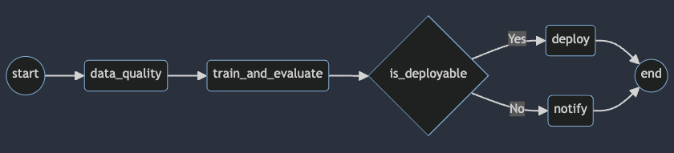

# building-an-advacnced-data-pipeline-with-data-quality-checks

## Overview

This project demonstrates a robust and scalable data pipeline for continuous machine learning model training, built with a strong emphasis on data quality. The pipeline ingests data from multiple sources (simulated ride-sharing vendors), validates the data using Great Expectations, trains a linear regression model to predict ride duration, and conditionally deploys the model based on performance metrics.  It leverages dynamic DAG generation in Apache Airflow for scalability and maintainability. This project was developed for demonstration and educational purposes.

## Project Goals

*   Demonstrate proactive data quality management within a data pipeline.
*   Implement a scalable and maintainable solution using dynamic DAGs.
*   Build a continuous training pipeline for a machine learning model.
*   Showcase the integration of various data engineering tools and technologies, including prompt engineering for code generation and testing.
*   Provide a working example of best practices for data engineering projects.

## Architecture
The following diagram illustrates the data flow and key components of the ML training pipeline:


*Figure 1: Architecture of the data pipeline, showing data flow from S3, through data quality checks with Great Expectations, model training, and conditional deployment.*


## Technologies Used

*   **Apache Airflow:** Workflow orchestration and scheduling.
*   **Great Expectations:** Data quality validation and testing.
*   **Python:** Primary programming language.
    *   **Pandas:** Data manipulation and analysis.
    *   **SciPy/NumPy:** Numerical computation and linear regression.
    *   **Jinja:** Templating engine for dynamic DAG generation.
*   **AWS:** Cloud infrastructure.
    *   **S3:** Data storage.
    *   **EC2:** Hosting the Airflow instance.
    *   **CloudFormation:** Infrastructure as code (optional - if you created scripts to automate the infrastructure setup).

## Data Sources

This project simulates data from three ride-sharing vendors:

*   Alitran
*   Easy Destiny
*   ToMyPlaceAI

The data is provided in Parquet format and includes features such as passenger count, trip distance, and ride duration. It is located in `data/work_zone/data_science_project/datasets/<VENDOR_NAME>/`.

## Getting Started

### Prerequisites

*   An AWS account (with appropriate permissions).
*   Python 3.7+ (or the specific version you used).
*   Basic understanding of prompt engineering for code interaction.

### Installation

1.  **Clone the repository:**

    ```bash
    git clone [Your GitHub Repository URL]
    cd [Repository Name]
    ```

2.  **Set up a virtual environment (recommended):**

    ```bash
    python3 -m venv venv
    source venv/bin/activate  # On Linux/macOS
    venv\Scripts\activate  # On Windows
    ```

3.  **Install dependencies:**

    ```bash
    pip install -r requirements.txt
    ```
    **(Make sure you create a `requirements.txt` file!  Use `pip freeze > requirements.txt` to generate it.)**

4.  **Configure AWS Credentials:**

    You'll need to configure your AWS credentials so that Airflow can access S3 and other AWS services. Choose *one* method and document it clearly:
    *   **Environment Variables:** Set `AWS_ACCESS_KEY_ID` and `AWS_SECRET_ACCESS_KEY`. (Least secure, but easiest for testing).
    *   **AWS CLI Configuration:** Use the `aws configure` command.
    *   **IAM Roles:** If running on EC2, assign an IAM role with the necessary permissions to the instance. (Most secure).

5.  **Create Airflow Variables:**

    Create an Airflow variable named `bucket_name` and set its value to the name of your S3 bucket:

    ```bash
    airflow variables --set bucket_name your-s3-bucket-name
    ```

### Running the Pipeline

1.  **Upload the DAGs and Great Expectations files to Airflow:**

    Copy the contents of the `src/dags` folder (including the `gx` subdirectory) to your Airflow DAGs folder.  If you're using S3, you can use the AWS CLI:

    ```bash
    aws s3 sync src/dags s3://<your-dags-bucket>/dags
    ```

2.  **Trigger the DAGs:**

    Go to the Airflow UI, find the dynamically generated DAGs, unpause them, and trigger them manually.

## Project Structure

```
├── data/                               # Raw and processed data
│   └── work_zone/
│       └── data_science_project/
│           └── datasets/
│               ├── <VENDOR_NAME>/      # Data for each vendor
│               │    ├── test.parquet
│               │    └── train.parquet
│           └── images/               # Screenshot images (optional)
├── scripts/                            # Utility scripts
│    └── restart_airflow.sh            # Script to restart Airflow (if needed)
├── src/                                # Source code
│   ├── dags/                          # Airflow DAG files
│   │   ├── model_trip_duration_*.py  # Dynamically generated DAGs
│   │   └── gx/                      # Great Expectations files
│   │       ├── checkpoints/           # (Optional) GX Checkpoints
│   │       ├── expectations/        # Expectation suites
│   │       ├── uncommitted/           # (Optional) Uncommitted GX files
│   │       └── ...
│   └── templates/                  # Jinja templates and config
│       ├── dag_configs/             # Configuration files for each vendor
│       │    ├── config_*.json
│       ├── generate_dags.py         # Script to generate DAGs
│       └── template.py              # Jinja template for DAGs
├── requirements.txt                 # Python dependencies
└── README.md                        # This file
```

## Data Quality Checks

The pipeline uses Great Expectations to perform data quality checks. The expectation suite is defined in `src/dags/gx/expectations/vendor_data_suite.json`. The key check ensures that the `passenger_count` column does not exceed 6.  Prompting techniques were used to help generate and refine the expectation suite.

## Dynamic DAG Generation

The DAGs are dynamically generated using Jinja templating. The template (`src/templates/template.py`) uses placeholders that are filled in by configuration files (`src/templates/dag_configs/config_*.json`). The `src/templates/generate_dags.py` script performs the generation.

## Model Training and Deployment

The pipeline trains a linear regression model to predict ride duration. The model is trained and evaluated within the Airflow DAG. A `BranchPythonOperator` conditionally "deploys" the model (simulated) if the RMSE is below a threshold.

## Lessons Learned

*   **Prompt Engineering:** Interacting with LLMs for code generation and testing requires careful prompt crafting.  It's not a replacement for understanding the underlying code, but it can significantly accelerate development.
*   **Configuration Management:** Managing configuration files for dynamic DAGs can become complex. I'm exploring more robust solutions for larger projects.
*   **Data Quality is Continuous:** Data quality isn't a one-time fix; it requires ongoing monitoring and refinement of expectations.
* **Airflow file placement**: Airflow will scan the files in the dags folder to find the DAG definition.

## Future Improvements

*   Implement more comprehensive data profiling using Great Expectations.
*   Integrate with a data quality monitoring and alerting system.
*   Explore using dbt for data transformations.
*   Refactor the model training code to run outside of the Airflow worker (e.g., using a KubernetesPodOperator).
*   Add unit and integration tests for the DAGs and custom operators.

## Contributing

[Optional: Include contribution guidelines if you're open to it.]

## License

[Optional: Choose a license (e.g., MIT, Apache 2.0).]
```
